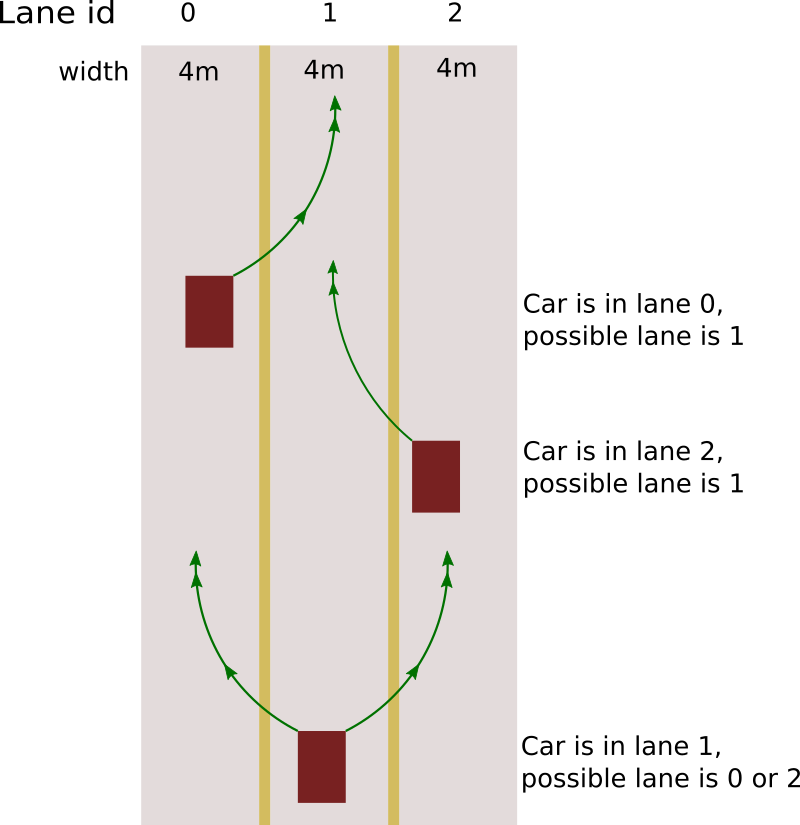

# CarND-Path-Planning-Project
Self-Driving Car Engineer Nanodegree Program

### Simulator.
You can download the Term3 Simulator which contains the Path Planning Project from the [releases tab (https://github.com/udacity/self-driving-car-sim/releases).

### Goals
In this project your goal is to safely navigate around a virtual highway with other traffic that is driving +-10 MPH of the 50 MPH speed limit. You will be provided the car's localization and sensor fusion data, there is also a sparse map list of waypoints around the highway. The car should try to go as close as possible to the 50 MPH speed limit, which means passing slower traffic when possible, note that other cars will try to change lanes too. The car should avoid hitting other cars at all cost as well as driving inside of the marked road lanes at all times, unless going from one lane to another. The car should be able to make one complete loop around the 6946m highway. Since the car is trying to go 50 MPH, it should take a little over 5 minutes to complete 1 loop. Also the car should not experience total acceleration over 10 m/s^2 and jerk that is greater than 10 m/s^3.

#### The map of the highway is in data/highway_map.txt
Each waypoint in the list contains  [x,y,s,dx,dy] values. x and y are the waypoint's map coordinate position, the s value is the distance along the road to get to that waypoint in meters, the dx and dy values define the unit normal vector pointing outward of the highway loop.

The highway's waypoints loop around so the frenet s value, distance along the road, goes from 0 to 6945.554.

## Basic Build Instructions

1. Clone this repo.
2. Make a build directory: `mkdir build && cd build`
3. Compile: `cmake .. && make`
4. Run it: `./path_planning`.

Here is the data provided from the Simulator to the C++ Program

#### Main car's localization Data (No Noise)

["x"] The car's x position in map coordinates

["y"] The car's y position in map coordinates

["s"] The car's s position in frenet coordinates

["d"] The car's d position in frenet coordinates

["yaw"] The car's yaw angle in the map

["speed"] The car's speed in MPH

#### Previous path data given to the Planner

//Note: Return the previous list but with processed points removed, can be a nice tool to show how far along
the path has processed since last time.

["previous_path_x"] The previous list of x points previously given to the simulator

["previous_path_y"] The previous list of y points previously given to the simulator

#### Previous path's end s and d values

["end_path_s"] The previous list's last point's frenet s value

["end_path_d"] The previous list's last point's frenet d value

#### Sensor Fusion Data, a list of all other car's attributes on the same side of the road. (No Noise)

["sensor_fusion"] A 2d vector of cars and then that car's [car's unique ID, car's x position in map coordinates, car's y position in map coordinates, car's x velocity in m/s, car's y velocity in m/s, car's s position in frenet coordinates, car's d position in frenet coordinates.

## Details

1. The car uses a perfect controller and will visit every (x,y) point it recieves in the list every .02 seconds. The units for the (x,y) points are in meters and the spacing of the points determines the speed of the car. The vector going from a point to the next point in the list dictates the angle of the car. Acceleration both in the tangential and normal directions is measured along with the jerk, the rate of change of total Acceleration. The (x,y) point paths that the planner recieves should not have a total acceleration that goes over 10 m/s^2, also the jerk should not go over 50 m/s^3. (NOTE: As this is BETA, these requirements might change. Also currently jerk is over a .02 second interval, it would probably be better to average total acceleration over 1 second and measure jerk from that.

2. There will be some latency between the simulator running and the path planner returning a path, with optimized code usually its not very long maybe just 1-3 time steps. During this delay the simulator will continue using points that it was last given, because of this its a good idea to store the last points you have used so you can have a smooth transition. previous_path_x, and previous_path_y can be helpful for this transition since they show the last points given to the simulator controller with the processed points already removed. You would either return a path that extends this previous path or make sure to create a new path that has a smooth transition with this last path.

## Tips

A really helpful resource for doing this project and creating smooth trajectories was using http://kluge.in-chemnitz.de/opensource/spline/, the spline function is in a single header file is really easy to use.

---

## Dependencies

* cmake >= 3.5
 * All OSes: [click here for installation instructions](https://cmake.org/install/)
* make >= 4.1
  * Linux: make is installed by default on most Linux distros
  * Mac: [install Xcode command line tools to get make](https://developer.apple.com/xcode/features/)
  * Windows: [Click here for installation instructions](http://gnuwin32.sourceforge.net/packages/make.htm)
* gcc/g++ >= 5.4
  * Linux: gcc / g++ is installed by default on most Linux distros
  * Mac: same deal as make - [install Xcode command line tools]((https://developer.apple.com/xcode/features/)
  * Windows: recommend using [MinGW](http://www.mingw.org/)
* [uWebSockets](https://github.com/uWebSockets/uWebSockets)
  * Run either `install-mac.sh` or `install-ubuntu.sh`.
  * If you install from source, checkout to commit `e94b6e1`, i.e.
    ```
    git clone https://github.com/uWebSockets/uWebSockets
    cd uWebSockets
    git checkout e94b6e1
    ```

## Editor Settings

* indent using spaces
* set tab width to 2 spaces

## Code Style
[Google's C++ style guide](https://google.github.io/styleguide/cppguide.html).


## Reflection
In this section the solution is described. See also  [rubrics](https://review.udacity.com/#!/rubrics/1020/view) for reference.

As stated above the goal of this project is:
* Move safely the car on the highway through traffic
* Change lanes with minimum jerk

### Move safely the car on the highway through traffic
The highway has three lanes, each lane has a width of 4 meters.
Lane id's starting from the left are used to identify the lanes in the code and
to calculate trajectories.



The above picture shows lane model and change pattens. The red car in the picture
can do one lane change at a time. Double lane changes are not favored and also
in the real world scenario are considered as a dangerous maneuver.
The car simulator provides within the sensor_fusion data all car objects d
etected by the sensors. On every update from simulator the surrounding
cars are sorted into two groups:

* Cars in front of the self driving vehicle
* Cars behind the self driving vehicle

For the lane in which self driving car is driving only distance to the object in front
is checked. The class path_planer is created to handle sensor data and provide
information for next possible and necessary actions.

```
class path_planer {
private:
  unsigned long cycle_count_;               //counts update cycles
  unsigned long lane_change_cycle_;         //at which cycle was lane change
  int safe_distance_front;                  //distance to car required for safe lane change
  int safe_distance_back;                   //distance to back car required for safe lane change
  double my_speed;                          //speed of the self driving car
  vector<vector<car_obj>> lane_obj_front_;   //keeps objects in front of me
  vector<vector<car_obj>> lane_obj_back_;    //keeps objects behind me
  //finds next free lane
  int get_next_free_lane(const int& lane);
  //checks whether it's safe to change to the lane with passed objects
  bool is_safe_to_chage(vector<car_obj>& front, vector<car_obj>& back);
public:
  virtual ~path_planer ();
  path_planer (const int& safe_distance_front, const int& safe_distance_back);
  //Returns a vector  with {too_close, max_speed, new_lane}
  vector<double> get_next_actions(const int& my_lane, const json& sensor_data);
};

```
Sorting objects into front and behind. Identify whether self driving car is
too close to the the car in front and remember it's speed.

```
  int obj_lane = get_obj_lane(d);
  // Car is in my lane
  if (obj_lane == my_lane) {
    //check car is in front of ego car and gap is smaller than 30m
    if((check_car_s > car_s) && (check_car_s - car_s) < 30){
      max_speed = check_speed;
      too_close = 1;
    }
  } else {
    if(obj_lane != -1){
      double d2m = check_car_s >= car_s ? (check_car_s-car_s):(car_s-check_car_s);
      car_obj c(check_car_s, d, check_speed, d2m);
      lane_obj_front_[obj_lane].push_back(c);
    }
  }

```
Pass telemetry data to path_planner and receive next actions. Change the lane
if the car is too close to the car in front. Reduce or increase speed if necessary.
```
vector<double> actions = my_ppl.get_next_actions(lane, j);
bool too_close = (actions[0] > 0);
max_velocity = actions[1];
int new_lane = (int)actions[2];
if (too_close) {
  if (new_lane != -1)
    lane = new_lane;
}
if (ref_velocity < max_velocity) {
  ref_velocity += (0.224 * 2);
} else {
  ref_velocity -= (0.224 * 2);
}
```
### Change lanes with minimum jerk
To change lanes with minimum jerk the spline library mentioned above  is used.
With the help of this library a smooth path is created which is given to the simulator
to follow.

```
tk::spline s;
s.set_points(pts_x, pts_y);
```
### Room for improvements
* Add trajectory generation and select trajectory based on cost functions
* Regulate speed in a more fluent way
* Add handling for suddenly stopping cars
* Add handling for sharp lane changes of other cars
* Add data based predictions
